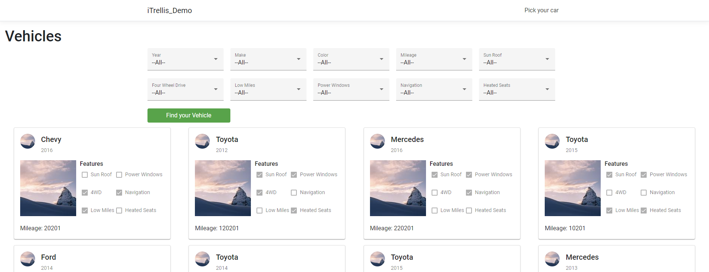
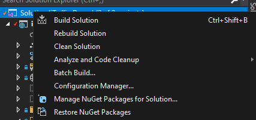
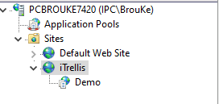
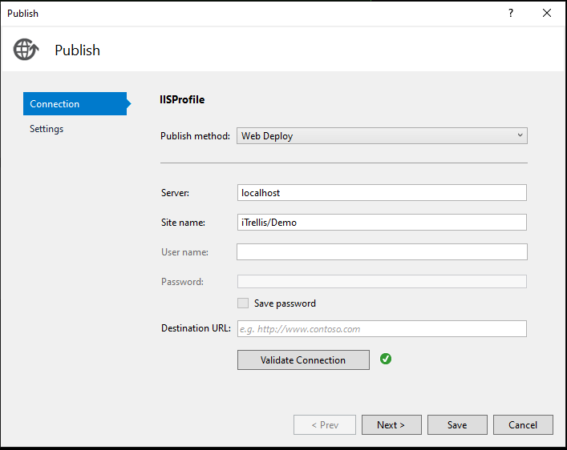
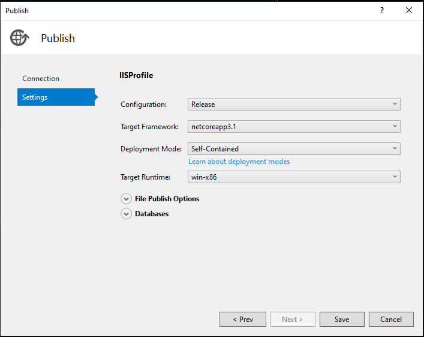
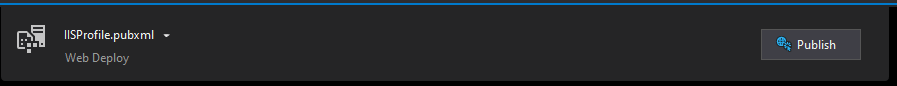
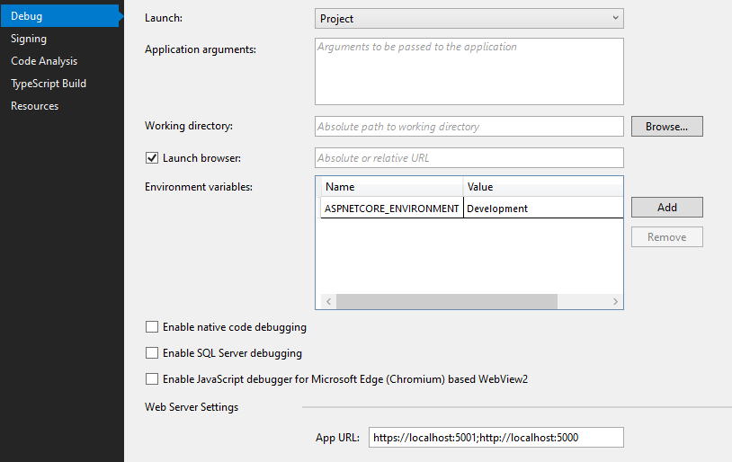
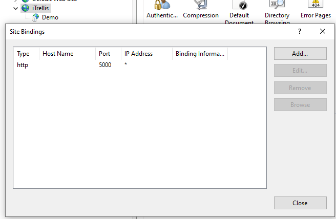
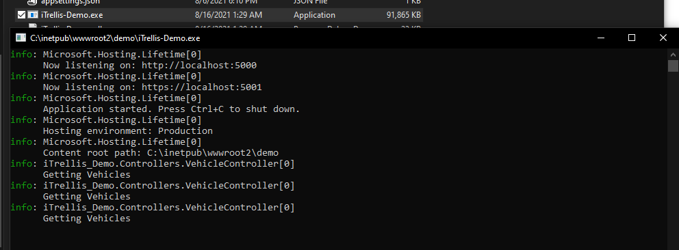

Download the repo code from https://github.com/keithgb/iTrellis-Demo

Open in Visual Studio 2019 and at the solution level right click and select Restore NuGet packages.

Create a Site and Application in IIS. e.g. iTrellis/Demo edit bindings and set port to 5000

Create a IIS Profile at Build > Publish

Click Publish to deploy to IIS

Both API and Site should be configured to ports 5000,5001 and point to dist folder generated by ng build via the publish to IIS.

IIS Bindings

At Site location click the executable iTrellis-Demo.exe and verify listening on the correct ports

Finally Navigate to https://localhost:5001/vehicledata